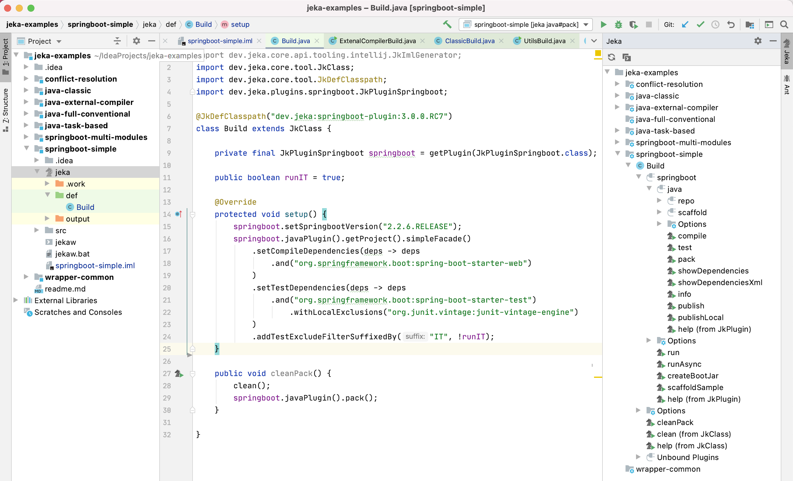
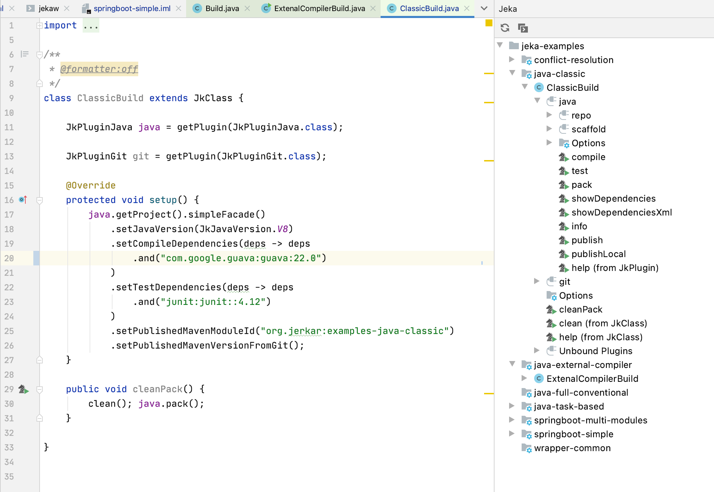

# Visual Jeka plugin for Intellij

Plugin for IntelliJ Idea.

This plugin provides :

* Jeka distribution management : user don't need to install Jeka manually.
* Project/Module creation from scratch
* Synchronize of .iml files according dependencies declared in modules
* right-side tool panel Jeka explorer
* Buttons to run/debug command methods directly from editor (similarly to @Test methods)
* Register automatically RunConfiguration while launching run/debug commands

Roadmap : 

* Provide a specific launcher to propose checkbox options
* Provide tree base collapsable console output
* Maven module auto-completion within Java Editor for `JkDependencies` API
* Display dependency trees in tool window.

# Where to download ?

* https://plugins.jetbrains.com/plugin/13489-jeka/

# How to use it ?

## 1. Create Jeka module from scratch
* Create an empty directory
* Right-click on directory icon and _jeka | Generate Jeka files and folder_ 
  

## 2. Synchronise module on Jeka file
* While editing the command class, right-click and click _Synchronize module_ 
  

  
## 3. launch commands from the editor
* In front of each command, click on the _Jeka Run icons to run/debug_ it.
  
 

## 4. Tool window

The tool window located at right side of the ide allows exploring and executing Jeka features.

# How to build ?

Use Gradle _buildPlugin_ task
  
# Resources 

* https://plugins.jetbrains.com/plugin/13489-jeka/

* https://plugins.jetbrains.com/docs/marketplace/plugin-upload.html

* https://www.jetbrains.org/intellij/sdk/docs/basics/run_configurations/run_configuration_management.html
   

 
