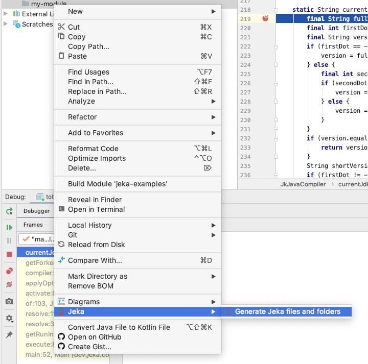
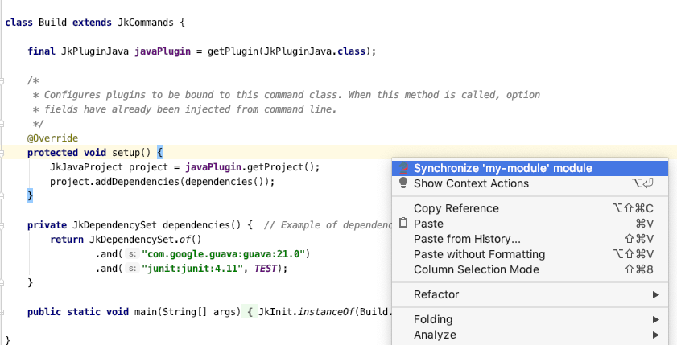
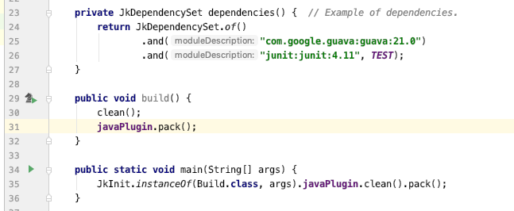
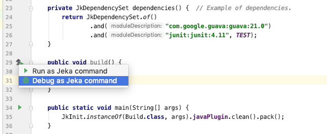

# Visual Jeka plugin for Intellij

Plugin for IntelliJ Idea.

This plugin provides :

* An ebedded version of Jeka : you don't have to install Jeka on your machine to use it !
* Jeka project creation from scratch
* Sync .iml files with Jeka command classes
* Buttons to run/debug command methods directly from editor (similarly to @Test methods)

Roadmap : 

* provide tree base collapsable output
* Maven module auto-completion within Java Editor for `JkDependency` API
* right-side tool panel to explore commands and options on a given project
 

# Where to download ?

* https://plugins.jetbrains.com/plugin/13489-jeka/

# How to use it ?

## 1. Create Jeka module from scratch
* Create an empty directory
* Right-click on it and click _jeka | Generate Jeka files and folder_ 

## 2. Generate module
* Right-click on it and click _jeka | Create Module_ 
  
## 3. Syncronise module on Jeka file
* While editing the command class, right-click and click _Synchronize module_ 
  
## 4. launch commands from the editor
* In front of each command, click on the _Jeka Run icons to run/debug_ it.

    
   
# How to build ?

Use Gradle _buildPlugin_ task
  
# Resources 

* https://plugins.jetbrains.com/plugin/13489-jeka/

* https://plugins.jetbrains.com/docs/marketplace/plugin-upload.html

* https://plugins.jetbrains.com/plugin/13489-jeka/

* https://www.jetbrains.org/intellij/sdk/docs/basics/run_configurations/run_configuration_management.html
   

 
