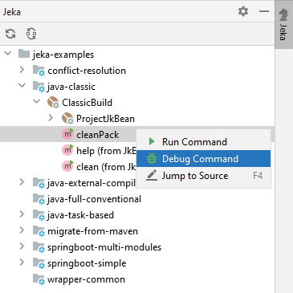
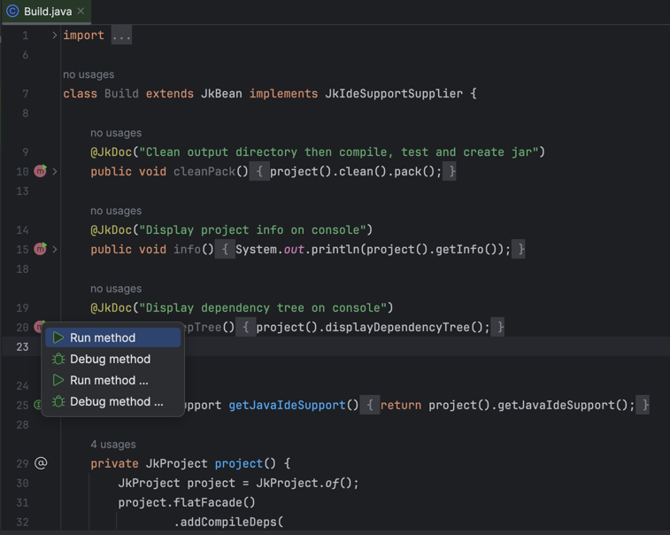

# Visual Jeka plugin for Intellij

## Features

* Jeka distribution management : user don't need to install Jeka manually.
* Project/Module creation and synchronization
* Window tool explorer
* Launching from contextual editors (Java, Kotlin, Properties)
* Autocompletion for commands and dependencies

## How to use it ?

A tutorial is available [here](https://jeka-dev.github.io/jeka/tutorials/gui-getting-started/#getting-started-with-jeka)

## Screenshots
Settings panel to manage installed Jeka distributions:

ToolWindow to explore KBeans and launch actions:

Contextual actions form source editor:

## Roadmap

* Provide a specific launcher to propose checkbox options
* Provide tree based collapsable console output
* Maven module auto-completion within Java Editor for `JkDependencies` API

## Where to download ?

* https://plugins.jetbrains.com/plugin/13489-jeka/

## How to build ?

Use Gradle _buildPlugin_ task
  
## Resources 

* https://plugins.jetbrains.com/plugin/13489-jeka/

* https://plugins.jetbrains.com/docs/marketplace/plugin-upload.html

   

 
